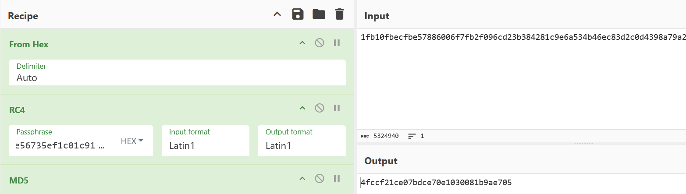

Woah! FRA has [CTFs!](https://challenge.fra.se/)

Let's get started. They kindly provided a hash, so we check that with `sha256sum` before we go any further and it checks out!

Here's the readme.txt

> Exfiltratören
> 
> Yta 0x33 AB, ett hemlighetsfullt företag i rymdbranschen, misstänker att en av dess
> anställda läcker känslig information till utomstående. Det är ett allvarligt
> läge, då det finns indikationer på att medarbetaren är agent för en aktör som
> planerar att genomföra ett inbrott på företaget. Analysera trafiken och försök
> hitta vilken information som har exfiltrerats. 
> 
> Utmaningen innehåller flaggor på formen /flagga{[[:ascii:]]+}/. Kan du hitta
> fler än två flaggor?
> 
> Skicka din lösning till rekrytering@fra.se. Lycka till!

Exciting! Anyway, as always I'm using Kali Linux, for all the sick tools ready to go, on a VirtualBox VM juuuuust in case. 

First, we use Wireshark to open the `.pcap` file. 

And with a quick perusal we see that packets 11 to 28 are interesting, so we right-click > Follow > TCP stream to see what's going on and find out a file has been transferred to the server 10.0.0.77. The msg.txt was packet 25 and was transferred using TCP, the contents is as follows:

> De är mig på spåren - jag går över till kamouflerad kommunikation. Vi hörs!
> 
> ZmxhZ2dhe2Z1bmN0aW9uYWxfdHJlc2hvbGRfcG93ZXJ9

Camouflaged communication? Sounds like steganography so we ought to keep a look out for it. 

> [!NOTE]
>  Steganography is a way one can hide data in ordinary files so it avoids detection. Think smuggling out confidential information from a system you've compromised by hiding them in something innocent like an image. Not that *you'd* ever do that, of course. Steganography can be done many different ways for many different reasons, and yes, one is 'camouflaged communication'.

Continuing on Flag 1 might be: `ZmxhZ2dhe2Z1bmN0aW9uYWxfdHJlc2hvbGRfcG93ZXJ9`

To test we need to get it in the right format and see if it follows the correct format:

`echo "ZmxhZ2dhe2Z1bmN0aW9uYWxfdHJlc2hvbGRfcG93ZXJ9" | base64 -d`
→ flagga{functional_treshold_power}

Yay, flag 1! (Haha, they spelt 'threshold' wrong.)

Anyway, the next interesting piece of information is the email that is sent which among other things says, 

>Tack för hjälpen, se bifogat som ett tecken på min uppskattning. ;)

Oj! That ;) just reeks of mischief. What help are they talking about? We'll need to investigate that later, but first we should look at the pdf and background png that was attached. It was encoded in base64 but it was easy enough to convert like we did before.

The result seems innocuous enough, a .pdf of a gift card for a coffee with a QR code and a .png of an empty frame, but we know better. 

Let's tackle the QR code first. We do some cursory poking around with `exiftool`and don't find much that's interesting other than:
```
Producer                        : cairo 1.15.10 (http://cairographics.org)
Create Date                     : 2024:11:13 09:38:53+01:00
```

But after cropping the .png to just the QR code and doing `zbarimg qr.png`.
We get what looks like nonsense:

 ```text
 7GHE+98T16D3000D00+B9US8000G20000Q00V50000T204DF-WV0002P0MB8Z98.30Y3IY+VKS0000B44J692X9W208 4%20.UGP50000%20$ETR2033695066CD10W9JN00SAE.ONFQ7000PD0BN9%Q8RA0MKH:WK000I.00C9VW83FTLN1W/669SDRU000D50 B9TB8A63WSCZ3IWZ1S8C:0238G FWXDW/YOE62VU3TFVM8KEWJE62I-N7.A%RG02T.XQTOM4/B9%842AC*V+QLGGTR/JUEWZVTE6233W99J P6P5JUQREMN8/B8%8L06*2MINEE1K:57.2C79H.SLQ9938WFGW+BW/9HH:3AAGMFK3AS4TBZ-FF40H7KAQGJ4TS/9G VXIF3DG87G+0EH0ED$N0 QH0DNZ2EDVV$A8OR7AQ8YTY7V21OQJE./PIP6VPTL$7H7FPX18L0G9PW.CFXP0 BS3G0PE/991U08%3M2R4 FYSJJRLWSGFMUBGWQ%VF5G*:AV 0X02LDWTAW6CT+WVXCQQK26K6HTJ**4%ITBJ7000-00KVE98BGPCX9E EDZ+DQ7A5LE8QD8UC634F%6LF6E44PVDB3DPECHFEOECLFFUJC-QE3$FXOR1LU000GQ2MY85WEEECBWE-3EKH7 3EG/DPQEDLF410MD6GO7B.R0003X4MY86WEIEC*ZCXPCX C7WE510846$Q6%964W5EG6F466G7 W6GL6VK52A6646:909RI000$00KVE98B2VC7WEHH7V3EREDGDFNF6RF64W5Y96*96.SAPA7VW64G7%/67461G7P56JXJF/I000S10CY8WU8RH8+2
 ```

But we are cleverer than that! This totally looks like something that's been encoded.

In comes [CyberChef](https://gchq.github.io/CyberChef/) !

> [!NOTE]
>  CyberChef is a webapp to decode data made by the Government Communications Headquarters (GCHQ), a intelligence and security agency involved in SIGINT and IA for the UK. Everyone say, "Thank you, GCHQ."
> Also remind me to never use the online version for anything actually sensitive (and to poke around the source code on the local version as well.)

If we do 'From Base45' (I just cycled through the bases till something worked. Hey, if it's stupid and it works, is it stupid?) and use the 'Magic' option, we get the suggestion to 'Render the Image' with input format raw and what do you know! Its an, albeit grainy, image of some text which says:

> Portkod: 1632
> flagga{qrazy_basy}

Haha, get it, 'QR'azy_basy? Ah, these FRA folks ought to moonlight as comedians. Anyway, that's the second flag found! Heck yeah! Examining the exif data here doesn't add much so let's move onto the .png.

After a lot, and I mean a lot, of poking around I'm 97.809% sure there's nothing in there and it's just a background image. But I could be wrong! 

Charging stubbornly forward, we notice a *very* odd thing happening. There's a UDP stream from 10.0.0.10 transferring a "top_secret.png" to 10.0.0.40, a previously unknown destination address. Well, that's not good.

We can see there are 2 streams if we filter for `udp.stream eq 1` and `udp.stream eq 0`. The first stream contains the actual data from 10.0.0.10 to 10.0.0.40 while the second contains crucial information about the data being transferred, namely:
- The encryption key which is `425c7548030e56735ef1c01c9182ec1f`
- The md5 hash which is `4fccf21ce07bdce70e1030081b9ae705`
- The chunk confirmations. 

The encryption key will allow us to decrypt the payload later, while the hash will help us check we have reconstructed the packets correctly. The true/false chunk confirmations will tell us which packets were actually delivered and which need to be filtered out. A quick search in Wireshark shows us there's only 1 false packet and it has the id `2251092`, since it's only one I won't do anything sophisticated to filter stream 1 using stream 0.

If you are unsure how to extract the data, you can use export using the options under File or use `tshark` but I just right-clicked on the stream I wanted to export and did Follow>Follow UDP stream>Save as…

Now there's definitely a more elegant solution out there but to reconstruct the UDP chunks I used the following python script:

```python
import json  
  
def main(file):  
      
    # open the file we've saved the raw data to  
    with open(file, 'r') as f:  
        content = f.read()  
          
    # convert from NDJSON to normal JSON  
    content = content.replace('}{', '}\n{')  
    raw_data = []  
    for line in content.splitlines():  
        if not line.strip():  
            continue  
        json_line = json.loads(line)  
        raw_data.append(json_line)  
          
    # this will hold our ix:data chunk keypairs  
    payloads_dict = {}  
    for packet in raw_data:  
        try:  
            payload = packet['chunk']['data']  
            payload_ix = packet['chunk']['ix']  
              
            # filter out the one false packet  
            if payload_ix != "2251092":  
                payloads_dict[payload_ix] = payload  
                payloads_dict[payload_ix] = payload  
  
        except Exception as e:  
            continue  
    # sort the dict based on the ix (index) of the packet  
    sorted_payloads = dict(sorted(payloads_dict.items()))  
    # store only the now ordered payload data into a list  
    payloads = sorted_payloads.values()  
    # combine the list items with no spaces  
    combined = ''.join(payloads)  
    # save to file  
    with open('payloads.txt', 'w') as f:  
        f.write(combined)  
  
  
if __name__ == '__main__':  
    main("raw.txt")
```

Remember that this will only work if you exported the data the way I did, if you used another method you need to tweak how you access the packet payload.

In comes our trusty friend CyberChef again. Use the recipe: From Hex, RC4 decryption with the encryption key we found earlier. Now you should see the output begins with PNG. Great, we successfully reconstructed a .png transferred over UDP! Just to check we can also do MD5 hashing on it to make sure we have done it all correctly and we have. 



> [!NOTE] Avalanche effect
> How hashing uses the avalanche effect

Now we can look at our image.


Er… It's... Picasso.

Anyway a quick check with `exiftool top_secret.png` gives:

```text
ExifTool Version Number         : 13.25
File Name                       : top_secret.png
Directory                       : .
File Size                       : 2.7 MB
File Modification Date/Time     : 2026:01:28 11:29:19-05:00
File Access Date/Time           : 2026:01:28 11:30:03-05:00
File Inode Change Date/Time     : 2026:01:28 11:29:30-05:00
File Permissions                : -rwxrwx---
File Type                       : PNG
File Type Extension             : png
MIME Type                       : image/png
Image Width                     : 1024
Image Height                    : 1024
Bit Depth                       : 16
Color Type                      : RGB with Alpha
Compression                     : Deflate/Inflate
Filter                          : Adaptive
Interlace                       : Noninterlaced
Warning                         : [minor] Text/EXIF chunk(s) found after PNG IDAT (may be ignored by some readers)
Exif Byte Order                 : Big-endian (Motorola, MM)
X Resolution                    : 72
Y Resolution                    : 72
Resolution Unit                 : inches
Y Cb Cr Positioning             : Centered
Exif Version                    : 0231
Components Configuration        : Y, Cb, Cr, -
User Comment                    : SMOkcG5hZHN2w6Rja2FuZGUgdmVya3NhbWhldCAtIHRyZWRqZSBncmFkZW4hIGZsYWdnYXtwbGF5X3RoZV81X3RvbmVzfQ==
Flashpix Version                : 0100
Color Space                     : Uncalibrated
Image Size                      : 1024x1024
Megapixels                      : 1.0
                                      
```

Right away we can see something interesting in the user comment!

So with `echo "SMOkcG5hZHN2w6Rja2FuZGUgdmVya3NhbWhldCAtIHRyZWRqZSBncmFkZW4hIGZsYWdnYXtwbGF5X3RoZV81X3RvbmVzfQ==" | base64 -d`we have our flag!

> Häpnadsväckande verksamhet - tredje graden! flagga{play_the_5_tones}

God above. That was a bit of work and I won't admit how long that took me. But we aren't done, what were they talking about "Tack för hjälpen"? We must have missed a flag. Let's go back and we can see ICMP packets 29 to 138 going from 10.0.0.10 to 10.0.0.99 and at this point we know that 10.0.0.10 is never doing anything innocent.

But how exactly they are exfiltrating the data is far from obvious. If we order filter the packets with `(_ws.col.protocol == "ICMP") && (ip.src == 10.0.0.10)` to just get packets from 10.0.0.10 using the ICMP protocol, we can see that most parts of the packet stays the same. But we should remember that we need variance to transmit data. So let's focus on that. 

At first, I tried to look at the timing but I couldn't find a pattern. I was clicking through the packets sequentially when I noticed that the only parts that change really are the parts referring to the checksum and, crucially, the Identification under `IPv4>Differentiated Services`.

If you click through the packets from 26 to 138, the last 4 bits of the Identification spells out something!
		
> vaktbyte kl 7, 15 och 23 dagligen. flagga{exf1l_by_p1ng}

This was definitely the hardest to figure out, but I think that's the last flag!

And with that Exfiltratören comes to a close and it was quite fun, think the FRA'll hire us?

You can count on more writeups on CTFs from them.

-T

| Flag no. | Flag                              |
| -------- | --------------------------------- |
| 1        | flagga{functional_treshold_power} |
| 2        | flagga{qrazy_basy}                |
| 3        | flagga{play_the_5_tones}          |
| 4        | flagga{exf1l_by_p1ng}             |
